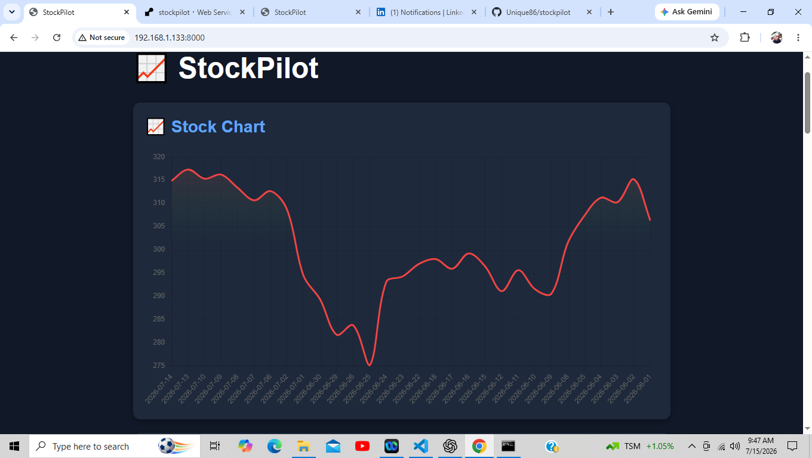
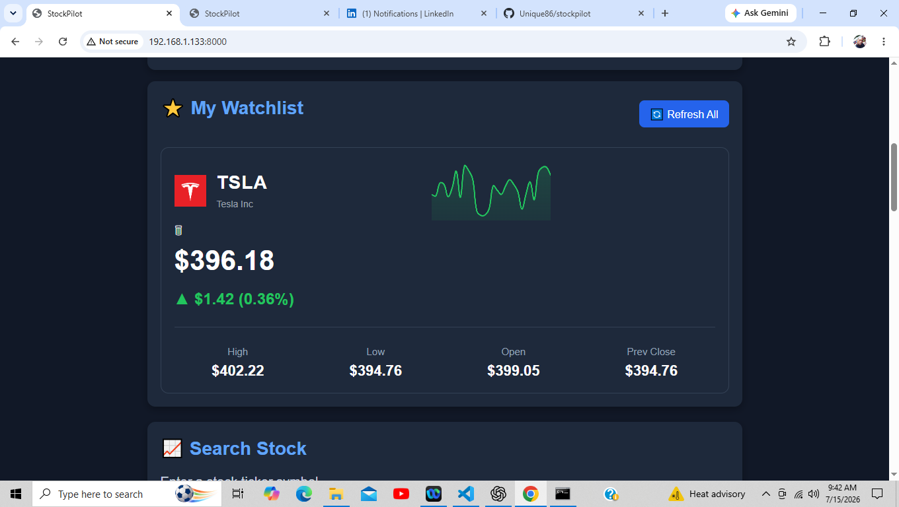
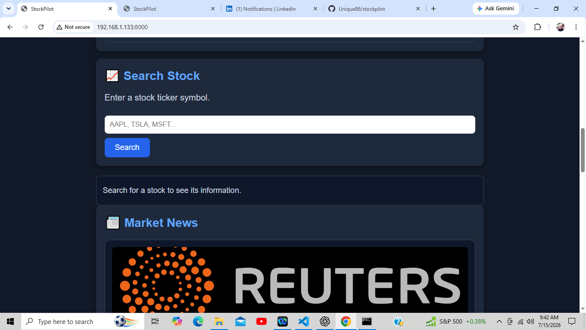
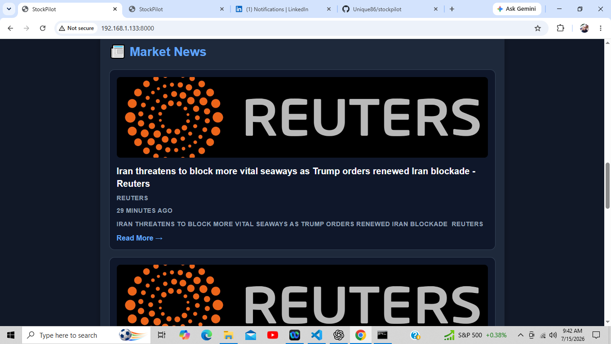

# 📈 StockPilot

## 🎯 Why I Built StockPilot

StockPilot was built to strengthen my full-stack development skills by creating a modern stock tracking application that combines live market data, interactive charts, responsive design, and REST API integration into a polished user experience.

The goal was to build a project that demonstrates both backend and frontend development while following clean architecture, reusable code, and continuous refactoring throughout development.

A modern **full-stack stock tracking application** built with **FastAPI**, **JavaScript**, and **Chart.js**.

StockPilot allows users to search live market data, build a persistent watchlist, visualize historical stock performance, and stay informed with the latest financial news through a clean, responsive interface designed for both desktop and mobile.

---

## 🚀 Features

- 🔍 Search stocks by ticker
- ⭐ Persistent watchlist using Local Storage
- 📈 Interactive historical price charts
- 📊 Expandable watchlist cards
- 🏢 Company logos and key market statistics
- 📰 Live market news
- 📱 Responsive desktop and mobile design
- ☁️ Deployed online with Render

---

## 🛠️ Tech Stack

### Backend
- Python
- FastAPI
- Uvicorn

### Frontend
- HTML5
- CSS3
- JavaScript (ES6)
- Chart.js

### APIs
- Finnhub API
- Financial Modeling Prep API

### Deployment
- Render

---

## 📸 Screenshots

## 📸 Screenshots

### Dashboard



---

### Watchlist



---

### Search



---

### Market News



---

## 🌐 Live Demo

**Live App:**

(Add your Render URL here)

---

## 💡 What I Learned

Building StockPilot strengthened my skills in:

- Designing and building full-stack web applications
- Developing REST APIs with FastAPI
- Consuming third-party APIs
- JavaScript DOM manipulation
- Asynchronous programming using async/await
- Building interactive charts with Chart.js
- Writing responsive CSS
- Refactoring JavaScript into reusable components
- Debugging deployment, networking, and browser caching issues

---

## 🔮 Future Improvements (V2)

- 🔎 Search by company name (Apple → AAPL, Google → GOOGL)
- ₿ Cryptocurrency support (Bitcoin, Ethereum, Solana, etc.)
- 👤 User accounts
- 📂 Multiple watchlists
- 💼 Portfolio tracking
- 🔔 Price alerts
- 📈 Advanced chart indicators

---

## ⚙️ Installation

Clone the repository:

```bash
git clone https://github.com/Unique86/stockpilot.git
```

Navigate into the project:

```bash
cd stockpilot
```

Install dependencies:

```bash
pip install -r requirements.txt
```

Run the application:

```bash
uvicorn app.main:app --reload
```

## Challenges

During development I solved several real-world engineering problems, including:

- Integrating multiple financial APIs for live and historical market data
- Refactoring large JavaScript files into reusable components
- Building responsive layouts for desktop and mobile devices
- Debugging WSL networking to enable testing across multiple devices
- Solving browser caching issues during mobile development

---

## 👨‍💻 Author

**Clifton Abraham**

**Full-Stack Developer**

GitHub: https://github.com/Unique86

LinkedIn: (Add your LinkedIn URL)

---

## 📄 License

This project is licensed under the MIT License.